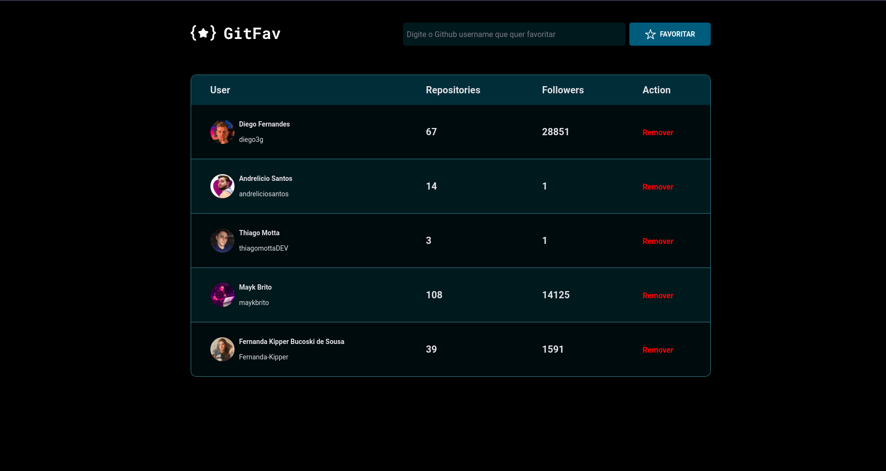

# GitFav

> Explorer - Stage 6

App criado para salvar os perfis de github favoritos do usuário,
usando boas práticas de clean code e de acessibilidade como divs SR-ONLY e fonts adaptáveis. 

Projeto construído no curso Explorer da Rocketseat Stage 6.

[Clique aqui para acessar](https://andreliciosantos.github.io/gitFav/)

## 🛠 Tecnologias 

- HTML
- CSS
- JavaScript
- JavaScript Modules
- LocalStorage
- Git e Github 

## 💛 Contato

andreliciosantos@proton.me  
[Linkedin](www.linkedin.com/in/andreliciosantos)  
[Instagram](https://www.instagram.com/andreliciosantos/)